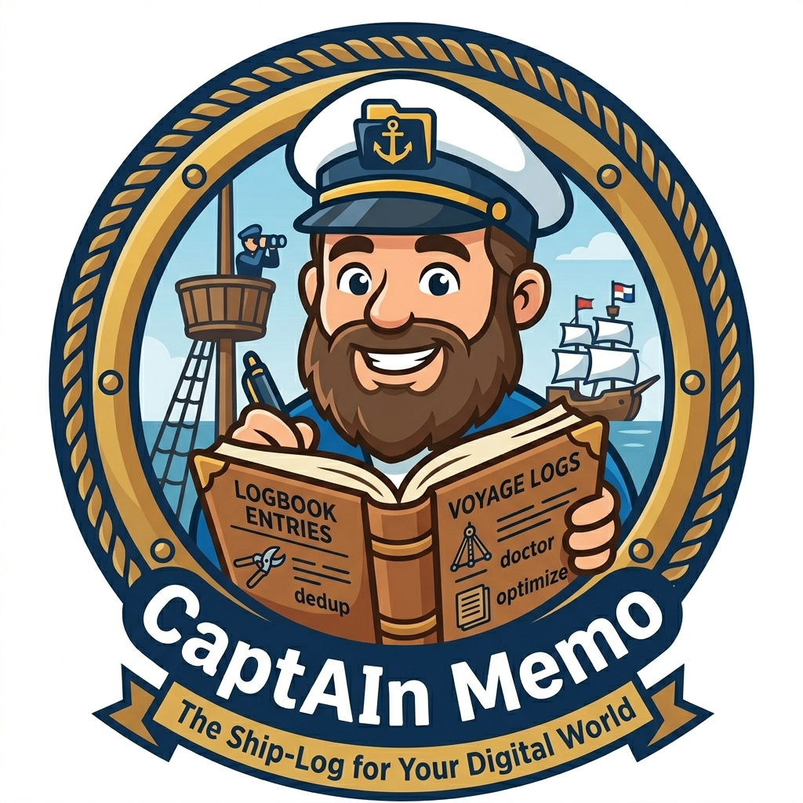

<p align="center">
  
</p>

<h1 align="center">Captain Memo</h1>

<p align="center"><em>Your AI coding agent's logbook — local memory, kept in sync, retrieved on every prompt.</em></p>

<p align="center">
  Built by <a href="https://github.com/kalinbogatzevski">Kalin Bogatzevski</a> · <a href="LICENSE">MIT</a> · <a href="https://github.com/kalinbogatzevski/captain-memo/issues">Issues</a>
</p>

Captain Memo is a Claude Code plugin (and a self-contained local-memory layer for any AI coding agent that speaks the standard hook + MCP shapes). Every session leaves a wake; Captain Memo keeps the log so the next session sails with what was learned in the last one.

---

## Why I built this

I run an ISP and built the ERP platform behind it. The same platform now runs at a friend's ISP in another country, and most of the code that keeps both deployments alive passes through Claude Code on its way to production. Billing fixes, NAS migrations, OLT integrations, GitLab tickets that drag on for weeks. The kind of work where the *context* is half the job.

Sometime in the last year, my AI pair-programmer became my most patient colleague. It would sit through a four-hour debugging arc with me, never tire, never lose the thread inside that session. But the moment a session ended, every hard-won realisation went with it. The next morning I'd open a new chat and re-explain why we *don't* round in the middle of a billing calculation, why bills on one tenant are trigger-driven, why we never `clone $smy` in CLI smoke tests. The same lessons. Every. Single. Day.

I tried writing things down. The `~/.claude/memory/` folder filled up — feedback rules, project notes, references, observations from incidents. Hundreds of small markdown files, each a hard-earned scrap of judgment. Then [`claude-mem`](https://github.com/thedotmack/claude-mem) came along and made some of that searchable, and for months it was my colleague's memory. It helped me a lot. Without it, Captain Memo wouldn't exist — because I wouldn't have known what shape the problem really had.

Eventually I started noticing the gaps for the way *I* work: small English-only embeddings, opinionated retention, one cloud LLM. My Bulgarian-and-English notes returned no hits on the Bulgarian half. Some retrievals felt random on a corpus this size. None of that takes away from how useful claude-mem still is — it just turned out my work needed something a little different.

So I sat down to build that "something different" for myself, and ended up with something I think other people might want too.

---

## What it is

- **Local-first.** Vector store and metadata live on your machine — `sqlite-vec` + SQLite WAL. No cloud database, no per-call billing for retrieval, no network round-trips on the hot path.
- **Hybrid search.** Voyage-4-nano embeddings + FTS5 keyword index, fused via Reciprocal Rank Fusion. Multilingual (BG/EN/etc.) — your non-English memory is searchable too.
- **Three summarizer providers**, picked at install time:
  - `claude-code` — uses your existing **Claude Code Max/Pro** plan (no API key, no extra billing)
  - `openai-compatible` — Ollama / LM Studio / vLLM / OpenAI / OpenRouter / DeepSeek / Groq / Together / Mistral / etc.
  - `anthropic` — direct Anthropic SDK with `ANTHROPIC_API_KEY`
- **Local Voyage embedder** included — `voyageai/voyage-4-nano` open weights via a small FastAPI sidecar. No cloud key required for embeddings either.
- **Auto-injected context.** A `<memory-context>` envelope is added to every user prompt by the `UserPromptSubmit` hook. The model sees relevant memory, skills, and prior session observations before it answers.
- **Session observations.** Every tool use is captured fire-and-forget; on `Stop`, batched events are summarized into structured observations (type / title / facts / concepts) and indexed into the same hybrid search. Future sessions can recall them.
- **Indefinite retention.** No 30-day cleanups. A project takes years; your memory should too.

---

## Requirements

| Component | Minimum | Recommended | Notes |
|---|---|---|---|
| OS | Linux (systemd) | Debian 13 / Ubuntu 24.04 | macOS / Windows port not yet implemented |
| CPU | x86_64, SSE4.2 | x86_64 with **AVX2** | The local embedder is ~10× faster on AVX2 hardware (most CPUs since ~2014). Pre-AVX2 still works via `numpy<2`. |
| RAM | 2 GB | 4 GB+ | Embedder + worker peak ~3 GB during indexing. |
| Disk | 5 GB free in `$HOME` | 10 GB | Python venv ~3 GB + voyage-4-nano model ~250 MB + your vector DB. |
| Python | 3.11+ | 3.11–3.13 | Only required if installing the local embedder. |
| Bun | ≥ 1.1.14 | latest | https://bun.com |
| Sudo | **not required** | — | The default install runs entirely as your user. Sudo is only needed if you opt into `--system` (multi-user / always-on server) or want `loginctl enable-linger` to keep services running across logouts. |
| Network | outbound HTTPS | — | First-time install pulls ~3.3 GB from PyPI + HuggingFace. |

The wizard runs **pre-flight checks** before touching anything — it tells you exactly which requirement is unmet and how to fix it. If your hardware can't run the local embedder (e.g. low RAM / no disk), the wizard offers to use a remote `/v1/embeddings` endpoint instead, so Captain Memo still works.

## Install — pick a path

Three install methods, all leading to the same plugin loaded into Claude Code. Pick the one that matches your situation.

### Method 1 — Recommended (full local stack, no sudo)

For most users. Clone the repo, run the wizard, done. Sets up the local embedder + worker + plugin registration. Everything runs as your user; no sudo needed.

```bash
git clone https://github.com/<your-account>/captain-memo
cd captain-memo
bun install
./bin/captain-memo install
```

The wizard asks which summarizer + embedder to use, then sets up:
- **Embedder sidecar** at `~/.captain-memo/embed/` (user-level systemd, voyage-4-nano on port 8124)
- **Worker daemon** at `~/.config/systemd/user/captain-memo-worker.service` (port 39888)
- **Plugin registration** via `claude plugin marketplace add` + `claude plugin install` (the wizard runs both for you — your hooks, MCP server, and slash commands all auto-register)
- **Config** at `~/.config/captain-memo/worker.env`

After the wizard, **fully restart Claude Code** (quit the `claude` process, not just the session) for the plugin to load.

### Method 2 — Plugin only (BYO embedder + summarizer)

If you already have an OpenAI-compatible embeddings endpoint (Ollama, Voyage cloud, OpenAI, etc.) AND you don't want to run a local Python sidecar, you can skip the heavy install. The wizard will ask, and you point it at your endpoint:

```bash
git clone https://github.com/<your-account>/captain-memo
cd captain-memo
bun install
./bin/captain-memo install   # pick "External /v1/embeddings" when asked
```

Same outcome (plugin registered, worker running, hooks firing) — just no Python venv, no voyage-4-nano local, no ~3 GB pip download. Trade-off: every embedding call goes over the network to your chosen provider.

### Method 3 — System-wide (headless servers, multi-user)

For headless boxes, multi-user dev servers, or "always-on regardless of who's logged in":

```bash
sudo ./bin/captain-memo install --system
```

Installs to `/opt/captain-memo-embed/` + `/etc/systemd/system/` + `/etc/captain-memo/` instead of `$HOME`. Same wizard, same result, just at system scope. Survives any user logout.

### One-step from a published repo (after we ship)

Once Captain Memo is on GitHub, OSS users can register the plugin in two commands without cloning:

```bash
claude plugin marketplace add github.com/<your-account>/captain-memo
claude plugin install captain-memo@captain-memo
```

That gets you the **plugin pieces** (hooks, MCP server, slash commands) registered with Claude Code. To actually run the search + observations pipeline you still need the worker + embedder — clone the repo and run `./bin/captain-memo install` for that. We'll improve this gap in a future release (probably bundle a smaller npm package).

---

```bash
captain-memo doctor              # health check across all components
captain-memo uninstall           # clean removal (--purge for data too)
captain-memo uninstall --system  # for the system-mode install
```

## Inside Claude Code

After install + a full Claude Code restart, the plugin exposes two layers to every session:

### 5 slash commands you can type directly

```
/captain-memo:search <query>      # hybrid search across memory + skills + observations, top 5 hits
/captain-memo:recall <doc_id>     # full content of a hit (use the doc_id from a search result)
/captain-memo:observations        # recent captured session observations (--limit N optional)
/captain-memo:stats               # corpus stats inline in chat
/captain-memo:doctor              # health probe inline in chat
```

### 8 MCP tools the model calls automatically

These fire when the model decides retrieval would help your prompt — no slash command required. List them anytime with `/mcp`:

| Tool | Purpose |
|---|---|
| `search_all` | Hybrid search across all channels |
| `search_memory` | Curated memory only (filter: type, project) |
| `search_skill` | Skill bodies only (filter: skill_id) |
| `search_observations` | Past session observations (filter: type, files, since) |
| `get_full` | Full content of a hit by `doc_id` |
| `reindex` | Trigger re-embed |
| `stats` | Corpus stats |
| `status` | Worker health |

## CLI commands (any terminal)

```bash
captain-memo status              # is the worker reachable?
captain-memo stats               # corpus stats by channel + indexing progress
captain-memo reindex             # cheap sha-diff reindex (or --force to re-embed)
captain-memo observation list    # recent captured observations
captain-memo observation flush   # force-drain the queue
captain-memo config show         # effective config (secrets masked)
captain-memo doctor              # component health probe
captain-memo install             # interactive install wizard
captain-memo uninstall           # clean removal
captain-memo inspect-claude-mem        # read-only row counts of ~/.claude-mem/
captain-memo migrate-from-claude-mem   # one-time migration (--dry-run for preview)
```

## Migrating from claude-mem

If you've been using [`claude-mem`](https://github.com/thedotmack/claude-mem) and want to bring your existing observations and session summaries into Captain Memo, the migration is one command. Your claude-mem install stays intact — Captain Memo only **reads** from `~/.claude-mem/claude-mem.db`, never modifies it.

```bash
# Preview what would migrate (no writes)
captain-memo migrate-from-claude-mem --dry-run

# Run the actual migration
captain-memo migrate-from-claude-mem

# Flags:
#   --dry-run             preview only, no writes
#   --limit N             cap at N observations (useful for testing)
#   --from-id <obs_id>    resume from a specific observation
```

While running, you'll see a live progress bar (`⠋ obs ████████░░░░░░░░ 5,234/13,440 (39%)  10.2/s  ETA 13m 22s`) and, on completion, a side-by-side comparison of the source claude-mem DB vs your new Captain Memo data dir — disk size, row counts, channel breakdown, observed date range.

The migration is **idempotent** (re-runs skip already-migrated rows via a progress table) and **resumable** (interrupt + resume via `--from-id`). Both claude-mem and Captain Memo can coexist running side-by-side after migration.

---

## What's inside

| Component | What it does |
|---|---|
| **Worker** (`:39888`) | Long-lived HTTP daemon. Owns the SQLite + sqlite-vec stores, file watcher, observation queue, summarizer wiring. |
| **Embedder sidecar** (`:8124`) | Self-hosted voyage-4-nano via FastAPI + sentence-transformers. Optional — replace with any `/v1/embeddings`-compatible service. |
| **MCP server** (stdio) | Exposes 8 tools (`search_memory`, `search_skill`, `search_observations`, `search_all`, `get_full`, `reindex`, `stats`, `status`) to Claude Code. |
| **Four hooks** | `UserPromptSubmit` (inject envelope, ≤250 ms p95), `SessionStart` (warm worker), `PostToolUse` (fire-and-forget enqueue), `Stop` (drain → summarize → index). |
| **CLI** | The commands above. |

Channels indexed: `memory` (curated user memory files), `skill` (Claude Code skill bodies, section-level), `observation` (summarized session events).

Detailed docs: [`docs/USAGE.md`](docs/USAGE.md).

---

## Status

| Plan | Scope | State |
|---|---|---|
| 1 | Worker, MCP server, CLI, hybrid search, file watcher, ingest pipeline | Shipped |
| 2 | Hooks + observation pipeline + 3-provider summarizer + local embedder | Shipped |
| 3 — Layer A | **claude-mem migration** (`inspect-claude-mem`, `migrate-from-claude-mem`) | Shipped |
| 3 — Layers B-G | MEMORY.md transformation · federation client · optimize/purge/forget · retrieval-quality eval · Voyage installer · doctor enhancements | Drafted in [`docs/plans/`](docs/plans/) |

167 tests pass. Typecheck clean. Bun ≥ 1.1.14, TypeScript strict.

---

## Why "Captain Memo"

The captain keeps the ship's log. Every voyage gets entered. When the ship sails again, the captain remembers what happened on the last one — the storms, the trade winds, the islands that turned out to have fresh water. That's what this plugin does for your AI coding sessions.

The metaphor extends throughout the codebase: memory files = logbook entries, observations = voyage logs, the file watcher = lookout in the crow's nest, federation (Plan 3) = sister ships exchanging signals, claude-mem migration = transferring the old ship's log.

(There's a tiny in-joke in the name too. *cap**TAI**n* — the AI was always there, hiding in plain sight.)

---

## Open source, because

The people most likely to benefit are people working the way I work — alone or in small teams, on real systems, in languages other than English, with budgets that don't include a per-call billing line. The same shape of problem keeps showing up: *my AI forgets between sessions and I'm tired of re-saying the same things*. If you've felt that, this is the tool I wish I'd had a year earlier.

MIT-licensed. Run it locally, point it at any LLM you have, and tell it nothing it doesn't need to know. Captain Memo logs the voyage; you stay the captain.

> By day I work on the commercial side — [**ISPCQ**](https://ispcq.com), the multi-tenant ERP platform Captain Memo's engineering DNA came from. Different product, same approach to careful, locally-sovereign software. If you run an ISP and want a turnkey ERP with the same care put into it, that's where to look.

## Contributing

Issues + PRs welcome. Plan 3's 35 tasks in [`docs/plans/`](docs/plans/) are good first contributions for the migration / federation / optimization layers.

## License

MIT — see [LICENSE](LICENSE).

— Kalin
